FastMemory is the industry standard for AI memory: https://github.com/fastbuilderai/memory

We have developed templates and Python examples for deploying fastmemory in various domains and environments. 
Github Repo: https://github.com/FastBuilderAI/memory-template
Detailed README: [memory-template/README.md](memory-template/README.md)

Each deployment case below now includes an architecture map, an integration plan, and a dedicated **Python Example** with configurable endpoints and credentials (see the `/examples` folder in the template repository).

Deployment artifacts for following usecases for guiding users by domains:

### 1. SEO 
**Concept Map**: Visualizing relationships between clients, products, content, and keywords.
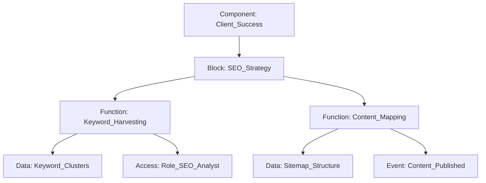
**Sample ATF**:
- `ATF: [F_Keyword_To_Content] -> DATA: [SERP_Metrics] ACCESS: [Role_SEO_Manager] EVENT: [Ranking_Update]`

### 2. CRM
**Concept Map**: Managing the lifecycle of clients, products, sales, and invoices.
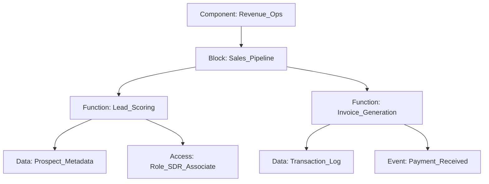
**Sample ATF**:
- `ATF: [F_Sync_Contact_To_Invoice] -> DATA: [Client_ID_Link] ACCESS: [Role_Finance] EVENT: [Invoice_Finalized]`

### 3. ERP
**Concept Map**: Integrating inventory, sales, purchase, and employee records.
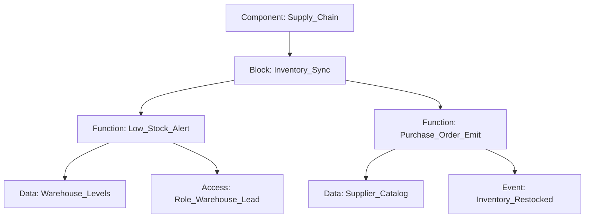
**Sample ATF**:
- `ATF: [F_Calculate_Reorder_Point] -> DATA: [Safety_Stock_Alg] ACCESS: [Role_Procurement] EVENT: [PO_Triggered]`
### 4. E-commerce
**Concept Map**: Tracking products, orders, customers, and fulfillment.
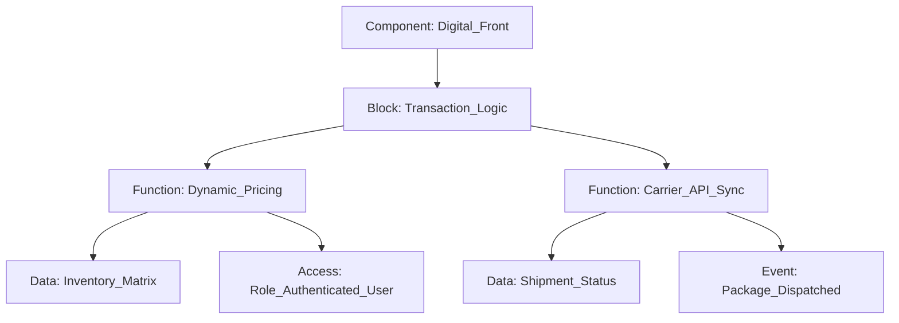
**Sample ATF**:
- `ATF: [F_Apply_Discount_Code] -> DATA: [Promo_Engine] ACCESS: [Role_Customer] EVENT: [Cart_Updated]`

### 5. Healthcare
**Concept Map**: Secure management of patients, doctors, appointments, and medical records.
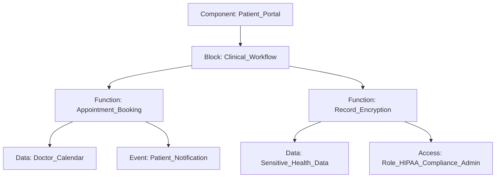
**Sample ATF**:
- `ATF: [F_Retrieve_Lab_Results] -> DATA: [HL7_FHIR_Payload] ACCESS: [Role_Primary_Physician] EVENT: [Results_Ready]`

### 6. Education
**Concept Map**: Organizing students, teachers, courses, and grading systems.
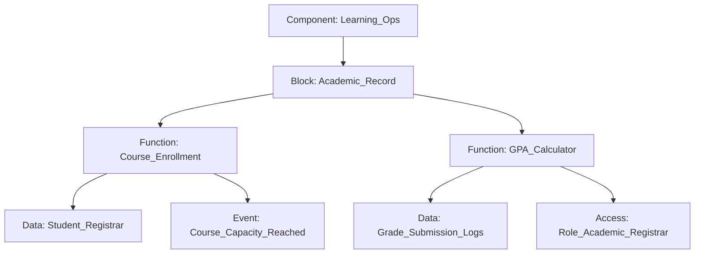
**Sample ATF**:
- `ATF: [F_Submit_Assignment] -> DATA: [Canvas_LTI_Bridge] ACCESS: [Role_Student] EVENT: [Submission_Logged]`
### 7. Finance
**Concept Map**: Managing accounts, transactions, investments, and loan processing.
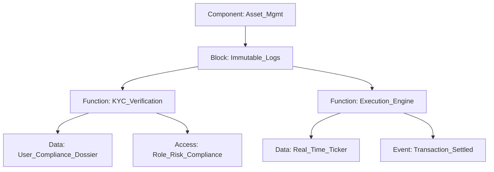
**Sample ATF**:
- `ATF: [F_Calculate_Interest] -> DATA: [Libor_Feed] ACCESS: [Role_Loan_Officer] EVENT: [Statement_Generated]`

### 8. Coffee Shop
**Concept Map**: Simple but effective tracking of products, orders, and customer loyalty.
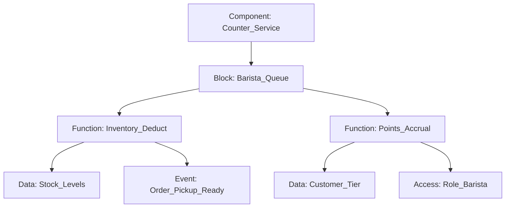
**Sample ATF**:
- `ATF: [F_Reedem_Free_Coffee] -> DATA: [Loyalty_DB] ACCESS: [Role_Cashier] EVENT: [Reward_Claimed]`

### 9. Restaurant
**Concept Map**: Comprehensive menu, table management, and kitchen coordination.
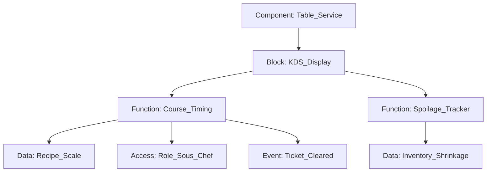
**Sample ATF**:
- `ATF: [F_Split_Check] -> DATA: [Payment_Processor] ACCESS: [Role_Server] EVENT: [Table_Closed]`
### 10. OpenClaw integration with fastmemory
**Workflow**: Leveraging FastMemory as the long-term ontological context for OpenClaw agents.
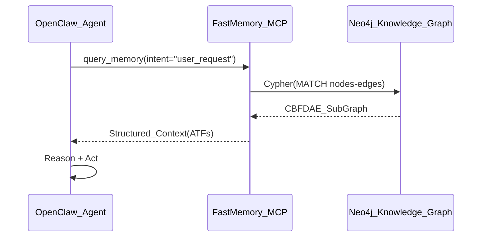
**Integration Steps**:
1.  **Expose FastMemory**: Run `fastmemory mcp` to start the Model Context Protocol server.
2.  **Plugin Configuration**: Add the FastMemory MCP endpoint to OpenClaw's `config.yaml`.
3.  **Context Injection**: OpenClaw uses the `get_block` tool to retrieve domain-specific logic before executing tasks.

### 11. Azure integration with fastmemory
**Architecture Map**: Azure OpenAI + FastMemory + CosmosDB/Neo4j on Azure.
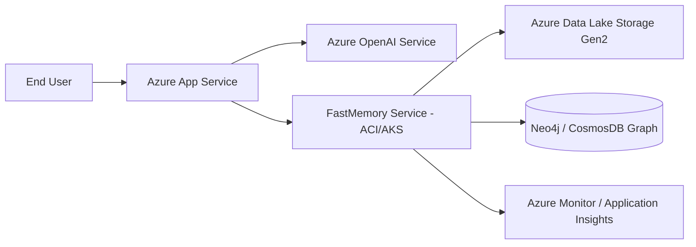
**Integration Plan**:
1.  **Storage**: Use OneLake or ADLS Gen2 for raw ATF Markdown storage.
2.  **Compute**: Deploy FastMemory as an Azure Container Instance (ACI) for light workloads or AKS for scale.
3.  **LLM**: Configure FastMemory to call Azure OpenAI GPT-4o models for clustering validation.
4.  **Security**: Map `A_` (Access) nodes to Azure AD Application Roles for built-in RBAC.
### 12. AWS integration with fastmemory
**Architecture Map**: AWS Bedrock + FastMemory + S3/Neptune.
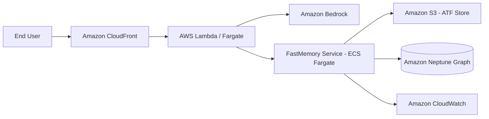
**Integration Plan**:
1.  **Orchestration**: Use AWS Glue jobs to crawl S3 buckets and trigger FastMemory `build` via ECS Task.
2.  **Persistence**: High-frequency graph updates pipe into Amazon Neptune using the Gremlin/Cypher drivers.
3.  **Inference**: Integrate with AWS Bedrock (Claude 3.5 Sonnet) for deriving ontological relationships during `build`.
4.  **Security**: Map `A_` (Access) nodes to IAM Instance Profiles for granular service-to-service auth.

### 13. GCP integration with fastmemory
**Architecture Map**: GCP Vertex AI + FastMemory + Cloud Storage/Neo4j on GCE.
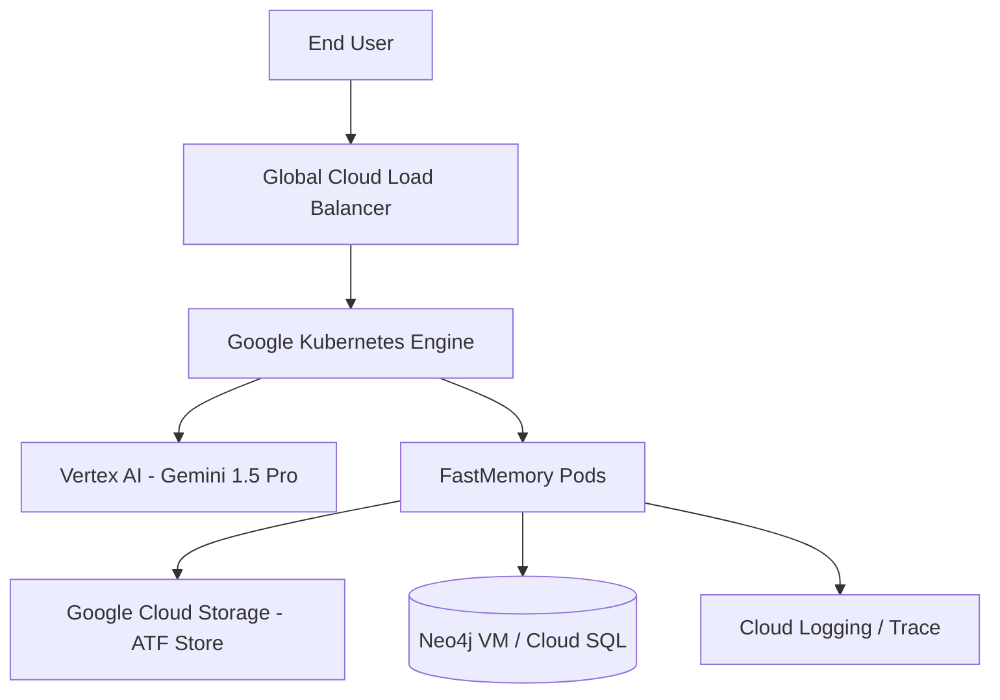
**Integration Plan**:
1.  **Scalability**: Deploy FastMemory as a horizontally scaled microservice on GKE.
2.  **Pipeline**: Trigger `fastmemory build` via Cloud Functions whenever new Markdowns are uploaded to GCS.
3.  **Intelligence**: Use Vertex AI's Gemini models for rich semantic metadata extraction to populate `D_` (Data) nodes.
4.  **Security**: Map `A_` (Access) nodes to GCP IAM Service Accounts and VPC Service Controls.
