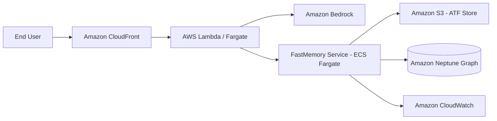

# AWS FastMemory Integration Template

## Architecture Map

## Integration Plan
1.  **Orchestration**: Use AWS Glue jobs to crawl S3 buckets and trigger FastMemory `build` via ECS Task.
2.  **Persistence**: High-frequency graph updates pipe into Amazon Neptune using the Gremlin/Cypher drivers.
3.  **Inference**: Integrate with AWS Bedrock (Claude 3.5 Sonnet) for deriving ontological relationships during `build`.
4.  **Security**: Map `A_` (Access) nodes to IAM Instance Profiles for granular service-to-service auth.
