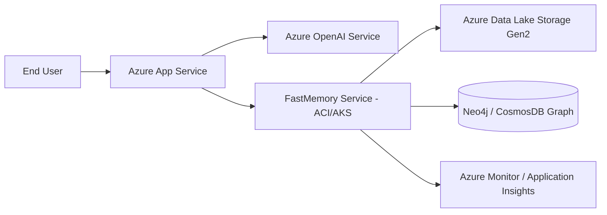

# Azure FastMemory Integration Template

## Architecture Map

## Integration Plan
1.  **Storage**: Use OneLake or ADLS Gen2 for raw ATF Markdown storage.
2.  **Compute**: Deploy FastMemory as an Azure Container Instance (ACI) for light workloads or AKS for scale.
3.  **LLM**: Configure FastMemory to call Azure OpenAI GPT-4o models for clustering validation.
4.  **Security**: Map `A_` (Access) nodes to Azure AD Application Roles for built-in RBAC.
