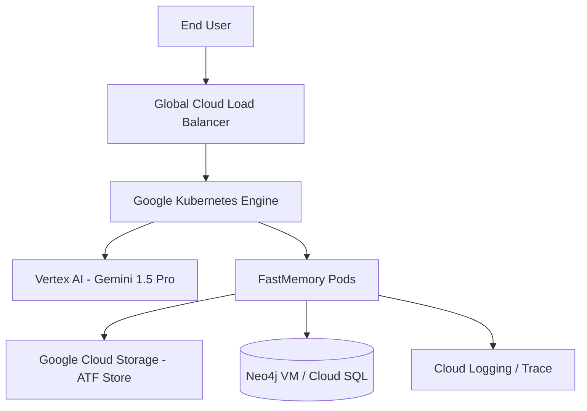

# GCP FastMemory Integration Template

## Architecture Map

## Integration Plan
1.  **Scalability**: Deploy FastMemory as a horizontally scaled microservice on GKE.
2.  **Pipeline**: Trigger `fastmemory build` via Cloud Functions whenever new Markdowns are uploaded to GCS.
3.  **Intelligence**: Use Vertex AI's Gemini models for rich semantic metadata extraction to populate `D_` (Data) nodes.
4.  **Security**: Map `A_` (Access) nodes to GCP IAM Service Accounts and VPC Service Controls.
