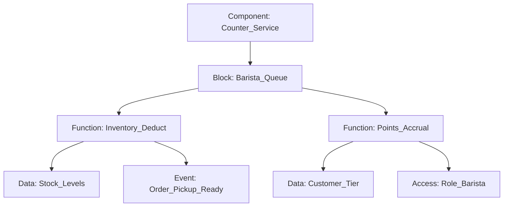

# Coffee Shop FastMemory Template

## Concept Map

```mermaid
graph TD
    C_POS[Component: Counter_Service] --> B_Orders[Block: Barista_Queue]
    B_Orders --> F_Brew[Function: Inventory_Deduct]
    B_Orders --> F_Loyalty[Function: Points_Accrual]
    F_Brew --> D_Beans[Data: Stock_Levels]
    F_Loyalty --> D_Member[Data: Customer_Tier]
    F_Loyalty --> A_Staff[Access: Role_Barista]
    F_Brew --> E_Ready[Event: Order_Pickup_Ready]
```

## Sample ATFs
- `ATF: [F_Reedem_Free_Coffee] -> DATA: [Loyalty_DB] ACCESS: [Role_Cashier] EVENT: [Reward_Claimed]`
