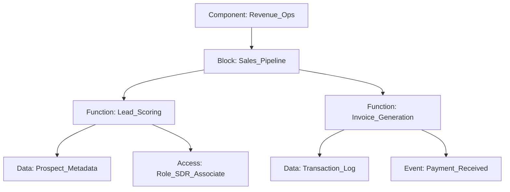

# CRM FastMemory Template

## Concept Map

```mermaid
graph TD
    C_Sales[Component: Revenue_Ops] --> B_Pipeline[Block: Sales_Pipeline]
    B_Pipeline --> F_Lead[Function: Lead_Scoring]
    B_Pipeline --> F_Inv[Function: Invoice_Generation]
    F_Lead --> D_Contact[Data: Prospect_Metadata]
    F_Inv --> D_Fin[Data: Transaction_Log]
    F_Lead --> A_SDR[Access: Role_SDR_Associate]
    F_Inv --> E_Paid[Event: Payment_Received]
```

## Sample ATFs
- `ATF: [F_Sync_Contact_To_Invoice] -> DATA: [Client_ID_Link] ACCESS: [Role_Finance] EVENT: [Invoice_Finalized]`
