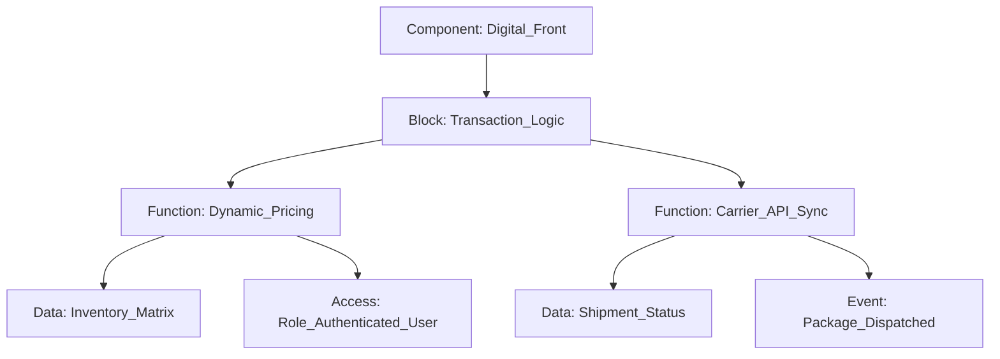

# E-commerce FastMemory Template

## Concept Map

```mermaid
graph TD
    C_Store[Component: Digital_Front] --> B_Checkout[Block: Transaction_Logic]
    B_Checkout --> F_Cart[Function: Dynamic_Pricing]
    B_Checkout --> F_Ship[Function: Carrier_API_Sync]
    F_Cart --> D_Prod[Data: Inventory_Matrix]
    F_Ship --> D_Track[Data: Shipment_Status]
    F_Cart --> A_Cust[Access: Role_Authenticated_User]
    F_Ship --> E_Del[Event: Package_Dispatched]
```

## Sample ATFs
- `ATF: [F_Apply_Discount_Code] -> DATA: [Promo_Engine] ACCESS: [Role_Customer] EVENT: [Cart_Updated]`
