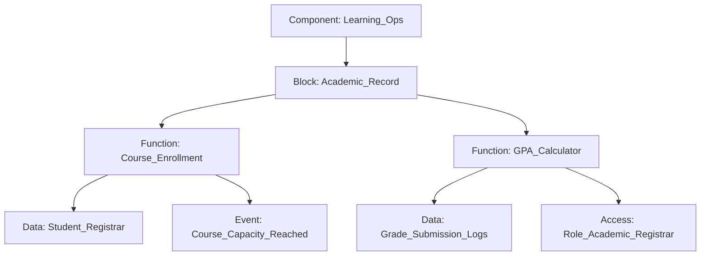

# Education FastMemory Template

## Concept Map

```mermaid
graph TD
    C_LMS[Component: Learning_Ops] --> B_Acad[Block: Academic_Record]
    B_Acad --> F_Enr[Function: Course_Enrollment]
    B_Acad --> F_Grad[Function: GPA_Calculator]
    F_Enr --> D_Class[Data: Student_Registrar]
    F_Grad --> D_Transcript[Data: Grade_Submission_Logs]
    F_Grad --> A_Registrar[Access: Role_Academic_Registrar]
    F_Enr --> E_Full[Event: Course_Capacity_Reached]
```

## Sample ATFs
- `ATF: [F_Submit_Assignment] -> DATA: [Canvas_LTI_Bridge] ACCESS: [Role_Student] EVENT: [Submission_Logged]`
