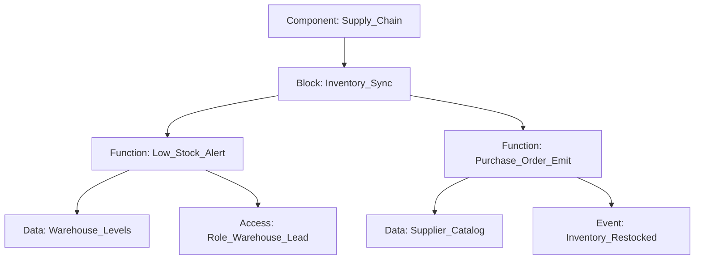

# ERP FastMemory Template

## Concept Map

```mermaid
graph TD
    C_Ops[Component: Supply_Chain] --> B_Inv[Block: Inventory_Sync]
    B_Inv --> F_Stock[Function: Low_Stock_Alert]
    B_Inv --> F_PO[Function: Purchase_Order_Emit]
    F_Stock --> D_SKU[Data: Warehouse_Levels]
    F_PO --> D_Vendor[Data: Supplier_Catalog]
    F_Stock --> A_WH[Access: Role_Warehouse_Lead]
    F_PO --> E_Refill[Event: Inventory_Restocked]
```

## Sample ATFs
- `ATF: [F_Calculate_Reorder_Point] -> DATA: [Safety_Stock_Alg] ACCESS: [Role_Procurement] EVENT: [PO_Triggered]`
