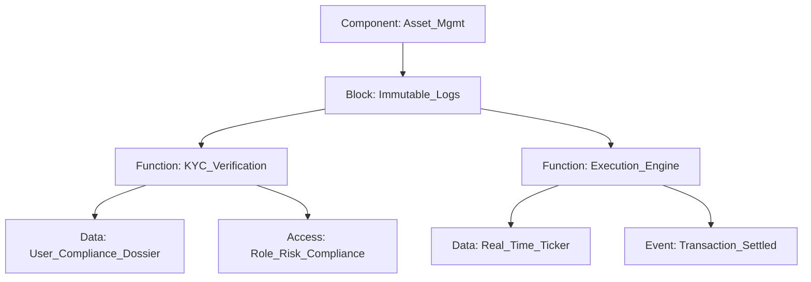

# Finance FastMemory Template

## Concept Map

```mermaid
graph TD
    C_Wealth[Component: Asset_Mgmt] --> B_Ledger[Block: Immutable_Logs]
    B_Ledger --> F_Audit[Function: KYC_Verification]
    B_Ledger --> F_Trade[Function: Execution_Engine]
    F_Audit --> D_ID[Data: User_Compliance_Dossier]
    F_Trade --> D_Portfolio[Data: Real_Time_Ticker]
    F_Audit --> A_SOX[Access: Role_Risk_Compliance]
    F_Trade --> E_Settle[Event: Transaction_Settled]
```

## Sample ATFs
- `ATF: [F_Calculate_Interest] -> DATA: [Libor_Feed] ACCESS: [Role_Loan_Officer] EVENT: [Statement_Generated]`
