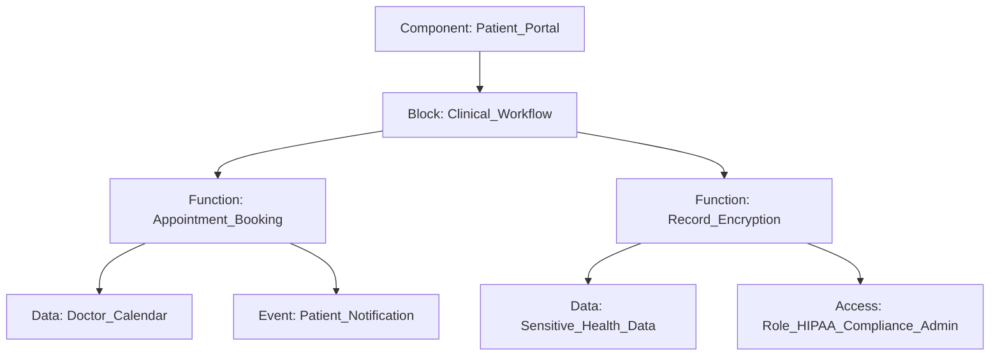

# Healthcare FastMemory Template

## Concept Map

```mermaid
graph TD
    C_EHR[Component: Patient_Portal] --> B_Clinic[Block: Clinical_Workflow]
    B_Clinic --> F_Sched[Function: Appointment_Booking]
    B_Clinic --> F_Hist[Function: Record_Encryption]
    F_Sched --> D_Avail[Data: Doctor_Calendar]
    F_Hist --> D_PHI[Data: Sensitive_Health_Data]
    F_Hist --> A_HIPAA[Access: Role_HIPAA_Compliance_Admin]
    F_Sched --> E_Remind[Event: Patient_Notification]
```

## Sample ATFs
- `ATF: [F_Retrieve_Lab_Results] -> DATA: [HL7_FHIR_Payload] ACCESS: [Role_Primary_Physician] EVENT: [Results_Ready]`
