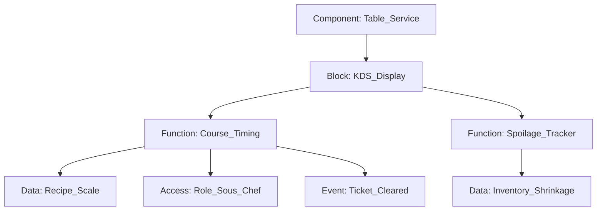

# Restaurant FastMemory Template

## Concept Map

```mermaid
graph TD
    C_Dining[Component: Table_Service] --> B_Kitchen[Block: KDS_Display]
    B_Kitchen --> F_Fire[Function: Course_Timing]
    B_Kitchen --> F_Waste[Function: Spoilage_Tracker]
    F_Fire --> D_Menu[Data: Recipe_Scale]
    F_Waste --> D_Loss[Data: Inventory_Shrinkage]
    F_Fire --> A_Chef[Access: Role_Sous_Chef]
    F_Fire --> E_Bump[Event: Ticket_Cleared]
```

## Sample ATFs
- `ATF: [F_Split_Check] -> DATA: [Payment_Processor] ACCESS: [Role_Server] EVENT: [Table_Closed]`
