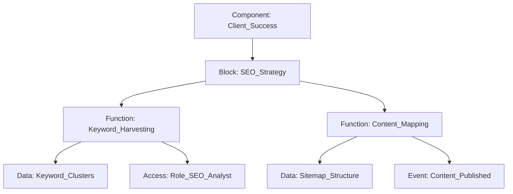

# SEO FastMemory Template

## Concept Map

```mermaid
graph TD
    C_Client[Component: Client_Success] --> B_SEO[Block: SEO_Strategy]
    B_SEO --> F_KW[Function: Keyword_Harvesting]
    B_SEO --> F_CM[Function: Content_Mapping]
    F_KW --> D_KWS[Data: Keyword_Clusters]
    F_CM --> D_SM[Data: Sitemap_Structure]
    F_KW --> A_Analyst[Access: Role_SEO_Analyst]
    F_CM --> E_Pub[Event: Content_Published]
```

## Sample ATFs
- `ATF: [F_Keyword_To_Content] -> DATA: [SERP_Metrics] ACCESS: [Role_SEO_Manager] EVENT: [Ranking_Update]`
