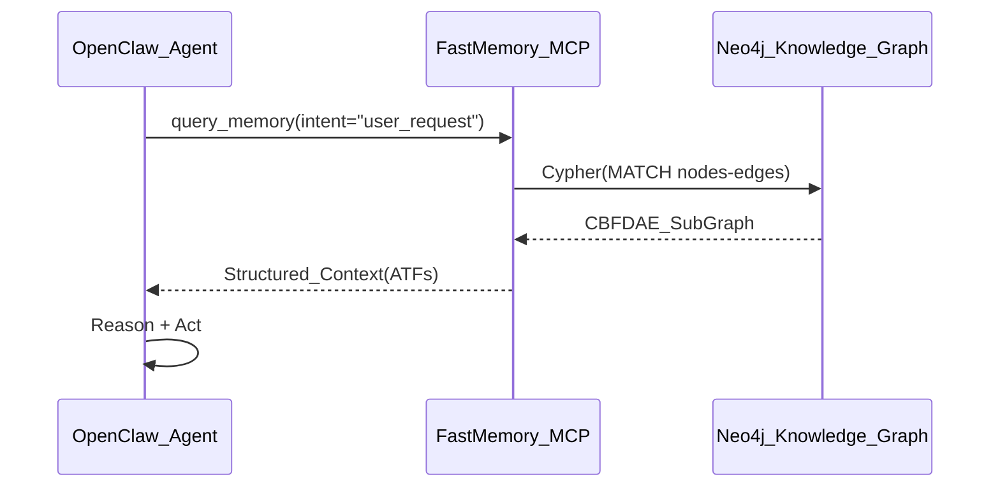

# OpenClaw FastMemory Integration Template

## Workflow

## Integration Steps
1.  **Expose FastMemory**: Run `fastmemory mcp` to start the Model Context Protocol server.
2.  **Plugin Configuration**: Add the FastMemory MCP endpoint to OpenClaw's `config.yaml`.
3.  **Context Injection**: OpenClaw uses the `get_block` tool to retrieve domain-specific logic before executing tasks.
